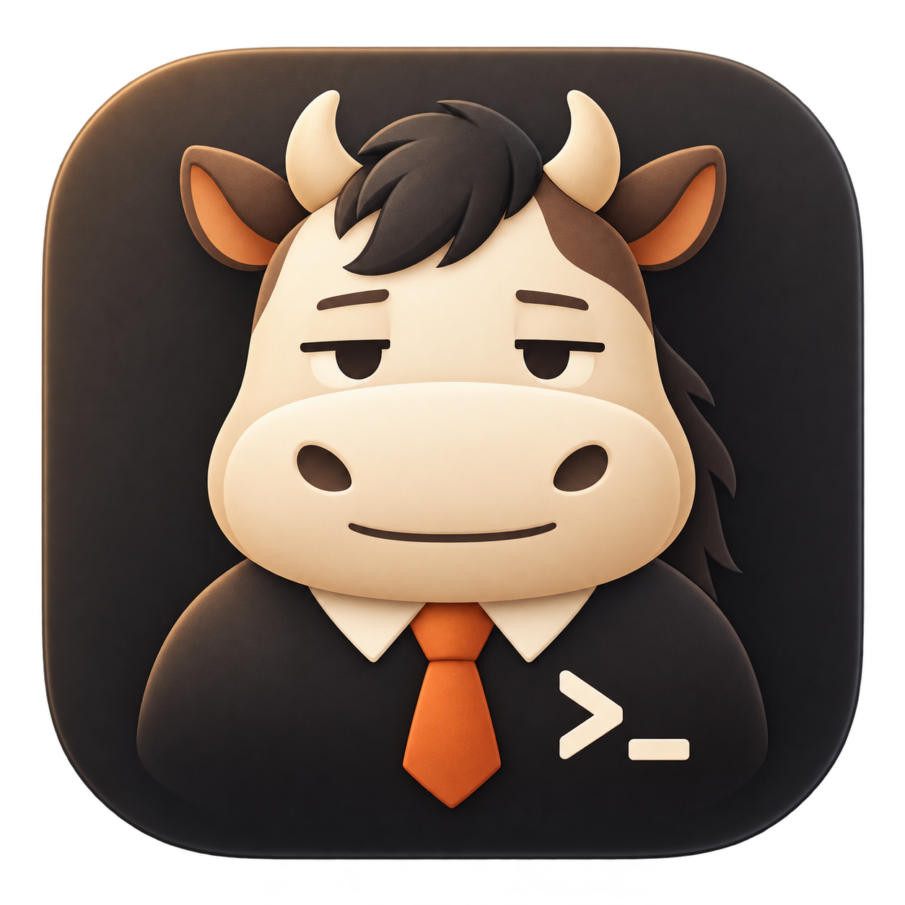

<p align="center">
  
</p>

<h1 align="center">NiumaTerm</h1>

<p align="center">A high performance multi-tab, multi-workspace terminal & agent application.</p>

<p align="center">
  <a href="LICENSE"></a>
  <a href="#windows"></a>
  <a href="#macos"></a>
</p>

## Features

- 100% native. No Electron. No WebView.
- Feature-rich terminal inspired by [rioterm](https://github.com/raphamorim/rio)
- High performance VT parser with [libghostty-vt](https://github.com/ghostty-org/ghostty) and [its Rust binding](https://github.com/uzaaft/libghostty-rs)
- GPU-accelerated UI with [Zed editor's GPUI](https://github.com/zed-industries/zed/tree/main/crates/gpui)
- UI components backed by [gpui-kit](https://github.com/longbridge/gpui-kit)
- Agent integrations including Claude Code, Codex and DeepSeek Harness.

## Build

Windows and macOS (Apple silicon) are supported.
Install Rust through rustup; the repository's `rust-toolchain.toml` selects the required toolchain.

### libghostty-vt

libghostty-vt is written in Zig, and most machines do not have a Zig toolchain installed.
This repository bundles prebuilt static libraries for Windows (`x86_64-pc-windows-msvc`) and macOS (`aarch64-apple-darwin`)
under `third_party/libghostty-vt-sys/prebuilt/`. Using them is **opt-in**: set the `NMT_USE_PREBUILT_LIBGHOSTTY`
environment variable to `1` to link the prebuilt library instead of building libghostty-vt from source.
The prebuilt libraries are optimized, so debug builds that use them also get a fast VT parser.

To build libghostty-vt from source instead, install Zig **0.16.0** and add `zig` to your `PATH`; the first build
then clones the pinned Ghostty sources and compiles them.

After updating the pinned Ghostty commit or its patches, regenerate the prebuilt libraries with
`scripts/update-libghostty-prebuilt.ps1` on Windows and `scripts/update-libghostty-prebuilt-macos.sh` on macOS.

### Windows

```powershell
# PowerShell

$env:NMT_USE_PREBUILT_LIBGHOSTTY="1"
cargo run --bin NiumaTerm
```

If you want to build libghostty-vt on your machine:

1. Install Zig toolchain `v0.16.0` (https://ziglang.org/download/) and add zig compiler to your PATH environment variable.
2. Make sure both `llvm-objcopy` and `llvm-nm` are in your PATH environment variable because compiling libghostty-vt requires them. Currently libghostty-vt's Zig simdutf dependency conflicts with rioterm's Rust dependency. This problem will be solved in future version.
3. Perform a normal `cargo run --bin NiumaTerm`.

### macOS

Use an Apple silicon Mac with Xcode and its Metal Toolchain installed. Select the full Xcode installation as the active developer directory. In Xcode, open **Settings → Components** and install **Metal Toolchain** if it is missing.
Zig is only needed to build libghostty-vt from source; with the prebuilt library, export `NMT_USE_PREBUILT_LIBGHOSTTY=1` first:

```sh
export NMT_USE_PREBUILT_LIBGHOSTTY=1
```

Build from the repository root, then create an application bundle so macOS can display the app icon and provide application services:

```sh
cargo build --locked
scripts/bundle-macos.sh --profile debug --out target/macos
open target/macos/NiumaTerm.app --args --testing
```

The bundle includes the icon at standard and Retina resolutions and is signed for local use. For an optimized build, use `cargo build --locked --release` and pass `--profile release` to the bundle script. If you set `CARGO_TARGET_DIR`, pass the resulting executable path with `--binary`.

## Development

Setup git hooks before committing anything:

```
git config core.hooksPath .githooks
```

## License

Licensed under the [MIT License](LICENSE).
